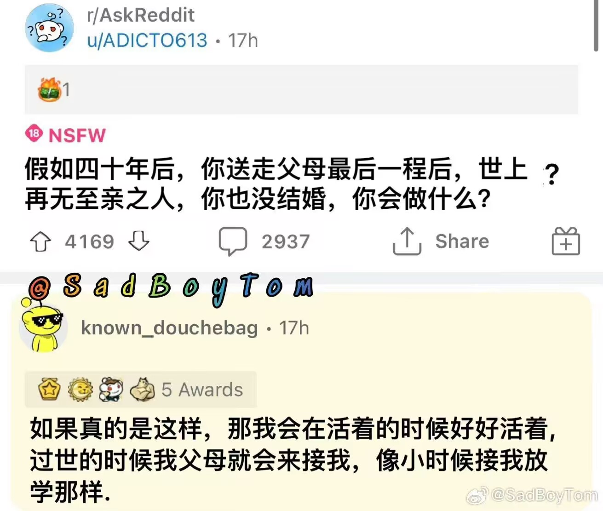

今天看到一个小朋友围着爸爸转圈圈跑，真好啊，突然好想回到小时候，天真快乐不知愁为何物。有时听到一首很久不听的歌，就突然想起以前听着这首歌的某一瞬间，这种感觉很奇特，历历在目却又触不可及。可能是天气冷了，人变得矫情起来，岁数没多大但很怀念过去，想慢慢走但又停不下来，很无奈啊。看到一句话，人生就是1／10的幸福，驱散着另外9／10的鸡毛蒜皮，要是能留住幸福的时候就好了，但这样时时刻刻的幸福反而变得廉价。这样最好了↓

